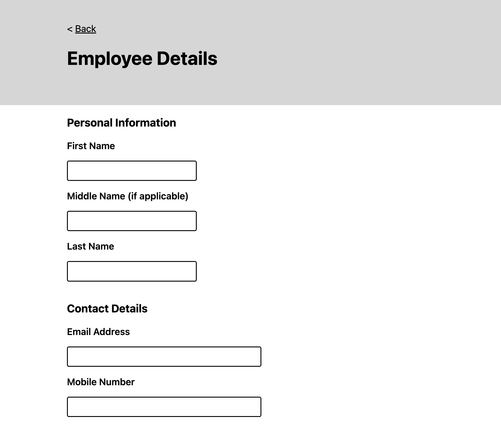

## dcs-tech-test

Employee information app built with React TypeScript + Java Springboot

# Demo & Snippets

# Requirement/Purpose

We need a web application to create, list, modify and delete employees. The application should consist of a
RESTful API (can be in .net core or any backend framework of your choice) and a React frontend. The schema for
the employee is left to the criteria of the candidate.

- Homepage listing employees - [x]
- Employee form for user to input new employee details -[x]
- Edit existing employees -[x]
- Remove/delete existing employees -[x]

Stack used:

- React
- Typescript
- SASS
- Java
- Springboot

# Build Steps

Prequisities:

- Vite
- Google Chrome
- VCS
- mySQL
- Eclipse IDE (version 2022-09 (4.25.0))

Steps:

- Clone repo
- navigate into front-end/ using CLI
- npm install
- npm run dev
- Open Google Chrome browser and copy link in command line (local: link) into browser searchbar.
- Import backend server into Eclipse IDE(version 2022-09 (4.25.0)): File -> Import -> Maven -> Existing Maven Projects
- Select backend/ and finish.
- Right click project in package explorer and click Run as -> 'Java Application'.
- Server will run on http://localhost:8080
- Create new database in mySQL
- update application.properties file in dcs-tech-test/backend/src/main/resources
  - jdbc:mysql://localhost:3306/<database-name>
  - username: your mysql server username
  - password: your mysql server password

# Design Goals/Approach

- For the backend, went with the generic pattern layers consisting of the Entity, Data Transfer Object (DTO), Controller, Repository and Service.
- For the front-end, a new employee page will consist of a form which will be used to add new employees via submission.
- On the homepage/mainpage, I'm going to have a button that will lead the user to a page that allows them to input information about the employee.
- On the homepage, there will be a remove button which will essentially delete the employee from the database and list.

# Features

- Add employee button on main page that leads user to a form where they can input information about a employee. react-form and simple validations were used to limit user to inputting required and appropriate information.
- Employee list that renders on main page with summary of their information: name, years employed, contract type and email.
- Remove button that deletes employee from database.
- Form hides the end date input if user selects permanent option.
- Added a page that allows user to edit current employee details.

# Known Issues

# Future Goals

- Make app responsive to phone screens
- Refactor code to make it more testable and understandable.
- Add in more test files to test rendering in other components in front end.
- Add in more tests for backend.

# Change Logs

# What did you struggle with?

- Creating the testing was quite a struggle due to not being comfortable enough with it.
- Figuring out how to connect the CRUD methods between front-end and back-end due to not being comfortable enough with it.

# Licencing Details

# Further Details

first and last name regex pattern
https://stackoverflow.com/questions/2385701/regular-expression-for-first-and-last-name

phone number
https://stackoverflow.com/questions/22378736/regex-for-mobile-number-validation#:~:text=%2F%5E(%5B%2B%5D%5C,%5Cd%7B10%7D%24%2F&text=This%20is%20how%20this%20regex,world%20wide%20matching%20of%20number.

email
https://www.w3resource.com/javascript/form/email-validation.php#:~:text=To%20get%20a%20valid%20email,%5D%2B)*%24%2F.
