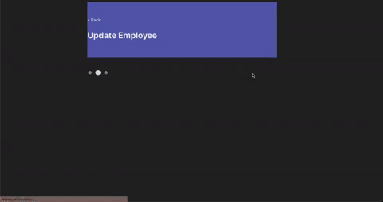

## employee-information

Employee information app built with React TypeScript + Java Springboot

# Demo & Snippets

# Requirement/Purpose

A web application to create, list, modify and delete employees. Purpose of project is to reinforce and upskill in creating a full-stack application and upskilling in React TypeScript and Java Springboot.

- Homepage listing employees - [x]
- Employee form for user to input new employee details -[x]
- Edit existing employees -[x]
- Remove/delete existing employees -[x]

Stack used:

- React
- Typescript
- SASS
- Java
- Springboot

# Build Steps

Prequisities:

- Vite
- Google Chrome
- VCS
- mySQL
- Eclipse IDE (version 2022-09 (4.25.0))

Steps:

- Clone repo
- navigate into front-end/ using CLI
- npm install
- npm run dev
- Open Google Chrome browser and copy link in command line (local: link) into browser searchbar.
- Import backend server into Eclipse IDE(version 2022-09 (4.25.0)): File -> Import -> Maven -> Existing Maven Projects
- Select backend/ and finish.
- Right click project in package explorer and click Run as -> 'Java Application'.
- Server will run on http://localhost:8080
- Create new database in mySQL
- update application.properties file in dcs-tech-test/backend/src/main/resources
  - jdbc:mysql://localhost:3306/<database-name>
  - username: your mysql server username
  - password: your mysql server password

# Design Goals/Approach

- For the backend, went with the generic pattern layers consisting of the Entity, Data Transfer Object (DTO), Controller, Repository and Service.
- For the front-end, a new employee page will consist of a form which will be used to add new employees via submission.
- On the homepage/mainpage, I'm going to have a button that will lead the user to a page that allows them to input information about the employee.
- On the homepage, there will be a remove button which will essentially delete the employee from the database and list.
- Isolated all the service/helper methods that will fetch/post data to the API server to 1 file called the api.ts.
  - This will allow the components to look more manageable and create better tests.
  - Now we are able to test pure rendering on the components and then test mock api calls in the api.ts file.
- EmployeeForm file now populates with default values depending on whether user presses 'edit' or 'add new employee'.

# Features

- Add employee button on main page that leads user to a form where they can input information about a employee. react-form and simple validations were used to limit user to inputting required and appropriate information.
- Employee list that renders on main page with summary of their information: name, years employed, contract type and email.
- Remove button that deletes employee from database.
- Form hides the end date input if user selects permanent option.
- Added a page that allows user to edit current employee details.
- Added in basic validation for all input fields.
  - Name, email, mobile number and address use regex pattern to validate.
  - End date uses watch feature from useForm hook that watches the start date user picks and sets min date to cover cases where user decides to pick an end date before the start date.
- Unit tests created for both componenents and some tests created for each service method for api service.
  - Test mock axios calls on each method to make sure they actually work.

# Known Issues

# Future Goals

- Make app responsive to phone screens
- Refactor code to make it more testable and understandable.
- Add in more test files to test rendering in other components in front end.
- Add in more tests for backend.
- Create a form component which renders default values or not depending on user action (clicking new employee or edit button)
  - reduces duplication in code.
  - may need to redo entire codebase.
- Create a service file which will house all methods involving API calls.
- Now that service files have been made that house helper functions, can now create isolated test files.
  - Test files that test whether files are rendered correctly.
  - Test files that test whether api calls are correctly being made.
- Add a pages section where main page only renders 5 employees. User will be able to navigate to other employees by clicking on page number. Alternatively, add a 'see more' button that renders more employees.
- add tests that cover failed api calls.

# Change Logs

# What did you struggle with?

- Creating the testing was quite a struggle due to not being comfortable enough with it.
- Figuring out how to connect the CRUD methods between front-end and back-end due to not being comfortable enough with it.

# Licencing Details

# Further Details

first and last name regex pattern
https://stackoverflow.com/questions/2385701/regular-expression-for-first-and-last-name

phone number
https://stackoverflow.com/questions/22378736/regex-for-mobile-number-validation#:~:text=%2F%5E(%5B%2B%5D%5C,%5Cd%7B10%7D%24%2F&text=This%20is%20how%20this%20regex,world%20wide%20matching%20of%20number.

email
https://www.w3resource.com/javascript/form/email-validation.php#:~:text=To%20get%20a%20valid%20email,%5D%2B)*%24%2F.
